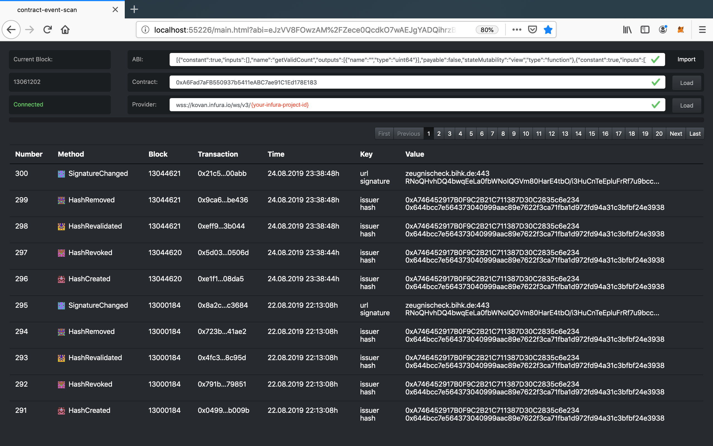

# Ethereum-Event-Scan

Ethereum-Event-Scan is a lightweight ethereum event explorer for smart contracts. 

It is a simple node.js application - the right tool when you develop smart contracts and your source codes is not yet submitted to Etherscan.
