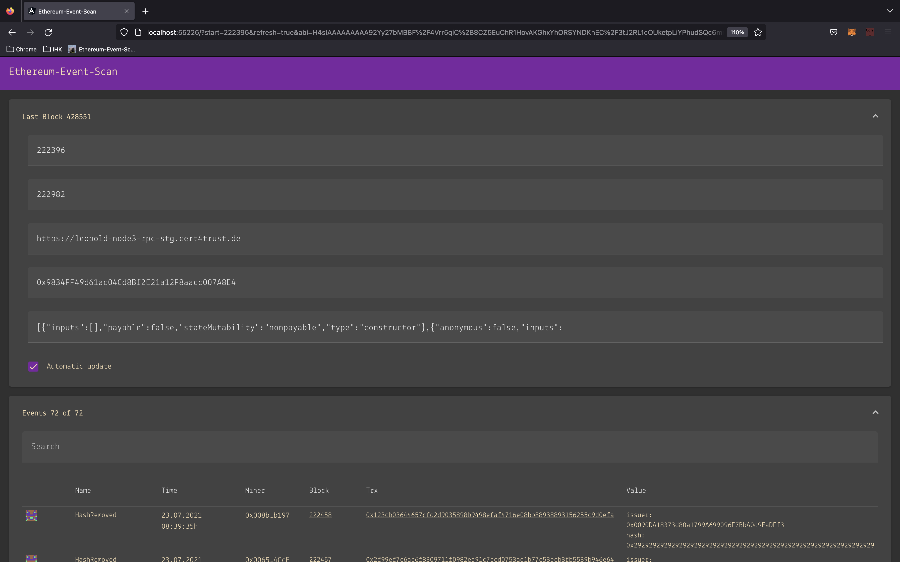

# Ethereum-Event-Scan

Ethereum-Event-Scan is a lightweight ethereum event explorer for smart contracts. The right tool when you develop smart contracts and your source codes is not yet submitted to Etherscan.

Find more details here: 
https://www.sw-engineering-candies.com/blog-1/ethereum-event-explorer-for-smart-contracts